<div align="center">

# LightningTrain

[](https://github.com/pre-commit/pre-commit)
[](https://pytorch.org/get-started/locally/)
[](https://pytorchlightning.ai/)
[](https://hydra.cc/)

A clean and simple PyTorch Lightning + Hydra projects.

</div>

## 📌  Introduction

This repository contains a simple PyTorch Lightning + Hydra project template. It is designed to be a starting point for your own projects. It is based on the [PyTorch Lightning](https://lightning.ai/docs/pytorch/stable/).

<br>

## 📦  Main Technologies

[PyTorch Lightning](https://github.com/PyTorchLightning/pytorch-lightning) - a lightweight PyTorch wrapper for high-performance AI research. Think of it as a framework for organizing your PyTorch code.

[Hydra](https://github.com/facebookresearch/hydra) - a framework for elegantly configuring complex applications. The key feature is the ability to dynamically create a hierarchical configuration by composition and override it through config files and the command line.

<br>

## 📁  Project Structure

The directory structure of new project looks like this:

```
lightningtrain
├── .dvc                 <- DVC files
├── data                 <- Data files
├── lightining                 
│   ├── .devcontainer         <- dev container files
│   ├── configs                 <- Configs
│   │   ├── callbacks              <- Callback configs
│   │   ├── data                   <- Data configs
│   │   ├── experiment             <- Experiment configs
│   │   ├── hydra                  <- Hydra configs
│   │   ├── logger                 <- Logger configs
│   │   ├── model                  <- Model configs
│   │   ├── paths                  <- Project paths
│   │   ├── trainer                <- Trainer configs
│   │   ├── __init__.py           <- Makes a Python module
│   │   ├── infer.yaml             <- Main config for inference
│   │   ├── eval.yaml           <- Main config for evaluation
│   │   └── train.yaml          <- Main config for training
│   ├── docker                 <- Docker files
│   ├── lightningtrain                    <- Source code
│   │   ├── data                     <- Data scripts
│   │   ├── models                   <- Model scripts
│   │   ├── utils                    <- Utility scripts
│   │   ├── infer.py                 <- Run inference
│   │   ├── train.py                 <- Run training
│   │   └── eval.py                  <- Run evaluation
│   ├── scripts                <- Scripts
│   ├── tests                  <- Tests of any kind
│   ├── .dockerignore                <- List of files ignored by docker
│   ├── Makefile                  <- Makefile with commands
│   ├── requirements.txt          <- File for installing python dependencies
│   └── setup.py                  <- File for installing project as a package
├── logger
│   ├── .devcontainer         <- dev container files
│   ├── docker                 <- Docker files
│   ├── .dockerignore                <- List of files ignored by docker
│   └── requirements.txt          <- File for installing python dependencies
├── demo                   <- Demo files
│   ├── .devcontainer         <- dev container files
│   ├── docker                 <- Docker files
│   ├── .dockerignore                <- List of files ignored by docker
│   ├── configs                 <- Configs
│   ├── utils                   <- Utility python scripts
│   ├── demo_gpt.py                 <- Run demo got GPT
│   ├── demo_vit.py                 <- Run demo for ViT
│   └── requirements.txt          <- File for installing python dependencies
├── logs                   <- Logs generated by hydra and lightning loggers
├── notebooks              <- Jupyter notebooks
├── outputs                <- Output files generated by lightining hydra
├── .gitignore                <- List of files ignored by git
├── data.dvc                  <- DVC file for data
├── docker-compose.yaml       <- Docker compose file
├── LICENSE                   <- License
├── logs.dvc                  <- DVC file for logs
├── outputs.dvc               <- DVC file for outputs
└── README.md                 <- Readme
```

<br>

## 🚀  Quickstart
```bash
# clone project
$ git clone https://github.com/sh-aidev/lightningtrain.git -b demo

# change directory to lightning
$ cd lightningtrain/lightning

# create docker container with .devcontainer.json
# or install dependencies locally

# install project as a package
$ pip install -e .

# run training
$ lightningtrain_train data.num_workers=8

# run demo for gpt
$ python3 lightningtrain/demo_gpt.py

# run demo for vit
$ python3 lightningtrain/demo_vit.py

```

## 🔧  Docker container usage instructions
**Prerequisites:**
- [Docker](https://docs.docker.com/get-docker/)
- [Visual Studio Code](https://code.visualstudio.com/)
- [Remote - Containers](https://marketplace.visualstudio.com/items?itemName=ms-vscode-remote.remote-containers) extension

**Steps:**
1. Clone this repository
2. Open the repository in Visual Studio Code
3. Use docker-compose to build the container
following commands:
```bash
# To only run lightining container and train run:

$ docker-compose run lightning

# To run logger container to start logger ui after training is done run:

$ docker-compose run logger

# To run both containers together run:

$ docker-compose up

# To stop containers run:

$ docker-compose down

# To run demo:
$ docker-compose run demo

# To run demo docker saparately:
$ cd demo
$ docker build . -t lightningtrain_demo:latest -f docker/Dockerfile.dev
$ docker run -it --rm lightningtrain_demo:latest -v ./outputs:/workspace/outputs

```
<br>

## 🗡 Demo usage instructions
**Steps to see VIT demo:**
1. Once docker starts running open localhost:8080 in browser:
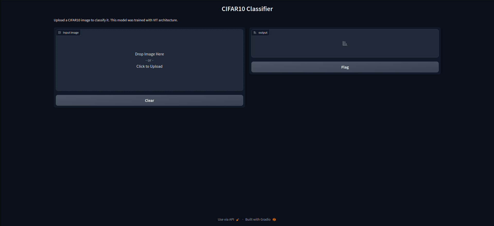
2. Click on upload and select a image to upload and we can see top 10 predictions as below:
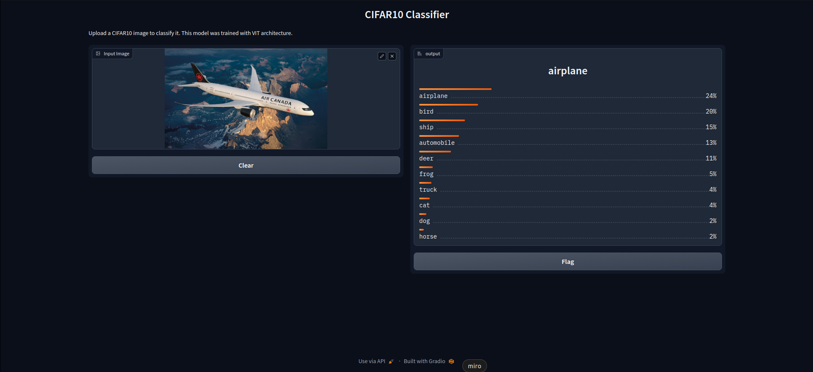

**Steps to see GPT demo:**
1. Once docker starts running open localhost:8080 in browser:
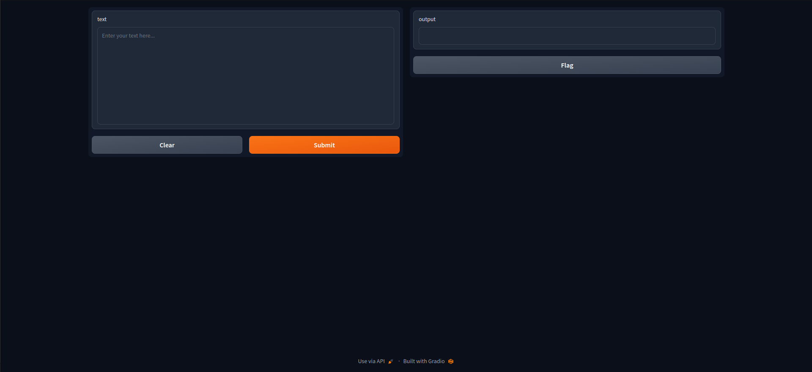
2. Write some text for completion and click on submit and we can see the completion as below:
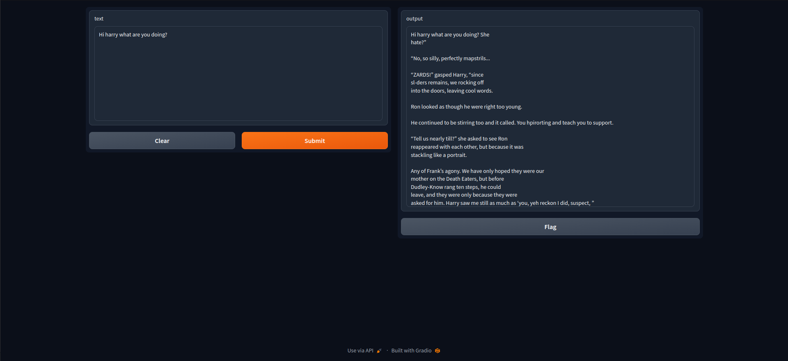

<br>

## 🗡 DVC usage instructions
**Prerequisites:**
- [DVC](https://dvc.org/doc/install)
- [DVC-gdrive](https://pypi.org/project/dvc-gdrive/)

**Steps:**
1. Clone this repository
2. Open the repository in Visual Studio Code
3. Run lightning training using above commands
4. Run following commands to push data, logs and outputs to gdrive:
```bash
# To initialize dvc run:
$ dvc init

# To add data run:
$ dvc add data

# In case you get error like ERROR:  output 'data' is already tracked by SCM (e.g. Git). You can remove it from Git, then add to DVC.
# Run following commands:
$ git rm -r --cached 'data'
$ git commit -m "stop tracking data"

# Then run the dvc add data again and do the same for the logs and outputs or any folder you want to track using dvc


# To add logs run:
$ dvc add logs

# To add outputs run:
$ dvc add outputs

# To add gdrive remote run:
$ dvc remote add --default gdrive gdrive://<you gdrive folder hash e.g. 1Vxjx2QERJnr58ECVHsyihJXkFBpFe1fj>
# You can get gdrive folder hash from browser folder link

# To add see dvc remote list run:
$ dvc remote list

# To push data to gdrive run:
$ dvc push -r gdrive

```


<br>

## 🗡  Logger UI usage instructions

**AIM Logger:**
1. Open AIM UI in browser at http://localhost:43800
2. Click on runs tab to see all runs:
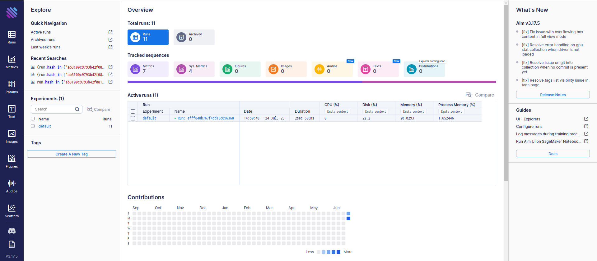
3. Select latest runs and click on compare to see all runs plots:
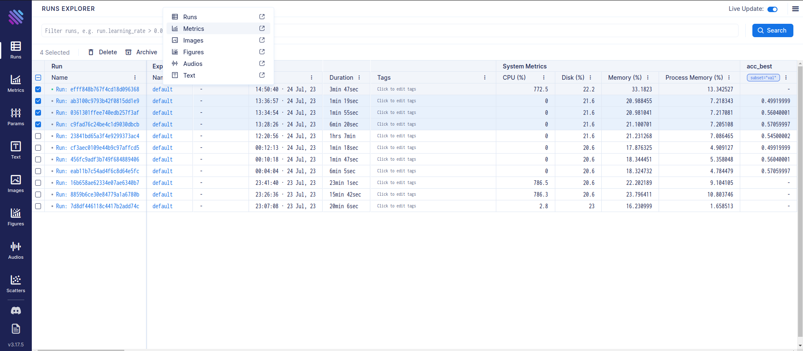
4. Click on edit icon and add val ccc matric to compare in Matrics tab and click on search:
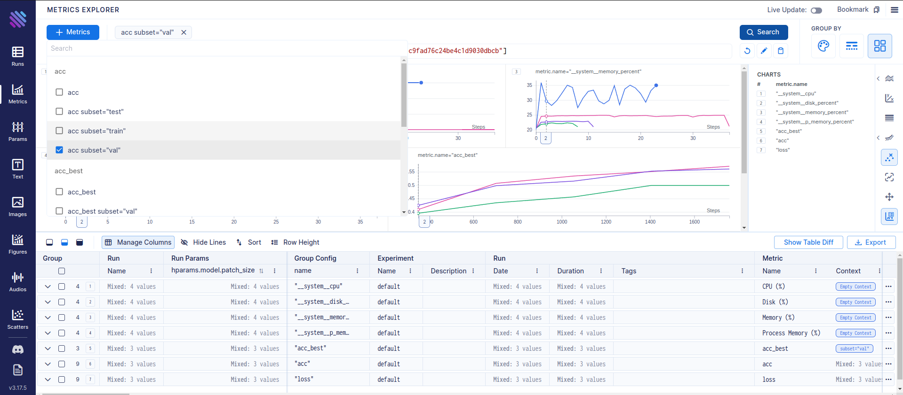
5. Search for the hyperparameter you want to compare in the below section and select group by color and you can see the comparison for the experiment(In our case patch_size):
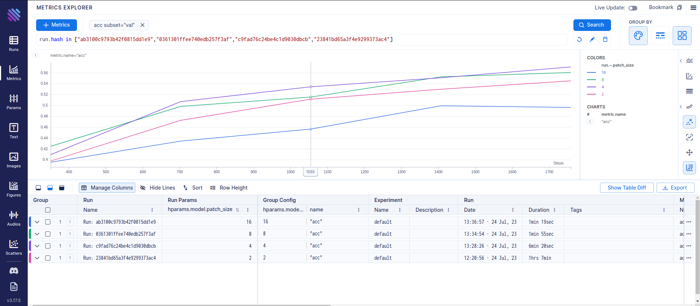

**MLFlow Logger:**
1. Open MLFlow UI in browser at http://localhost:5000
2. Click on experiments name to see all runs for that experiment:
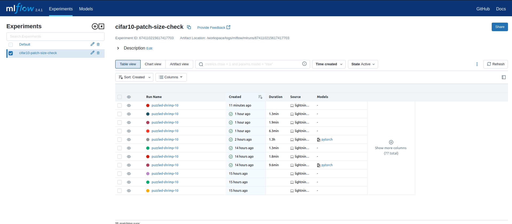
3. Click on runs you want to comapre and click on compare to see all runs plots:
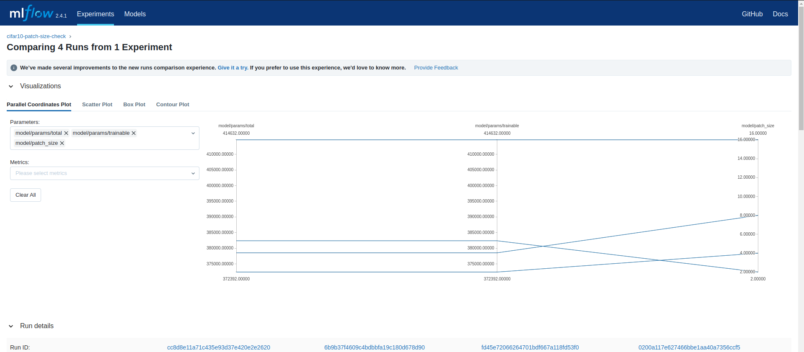
4. From left side Parameters section select the hyperparameter you want to compare e.g. patch_size and from Matrics section select the matric you want to compare e.g. val/acc and epoch then you can see the plots for the experiment(In our case patch_size):
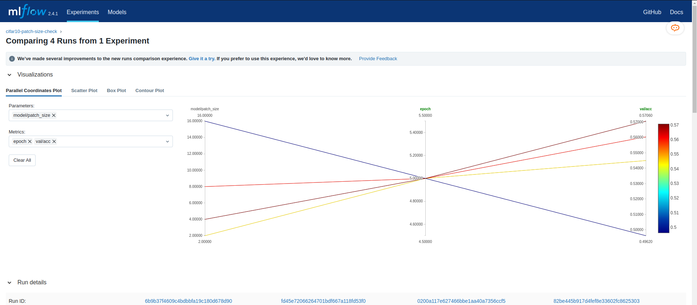
<br>


## 🧰 References
- [PyTorch Lightning](https://lightning.ai/docs/pytorch/stable/)
- [Hydra](https://hydra.cc/docs/intro/)
- [Lightning-Hydra-Template](https://github.com/ashleve/lightning-hydra-template.git)
- [Lightning Template](https://github.com/satyajitghana/lightning-template.git)
- [AIM](https://aimstack.readthedocs.io/en/latest/overview.html)
- [MLFlow](https://mlflow.org/docs/latest/tracking.html)

<br>